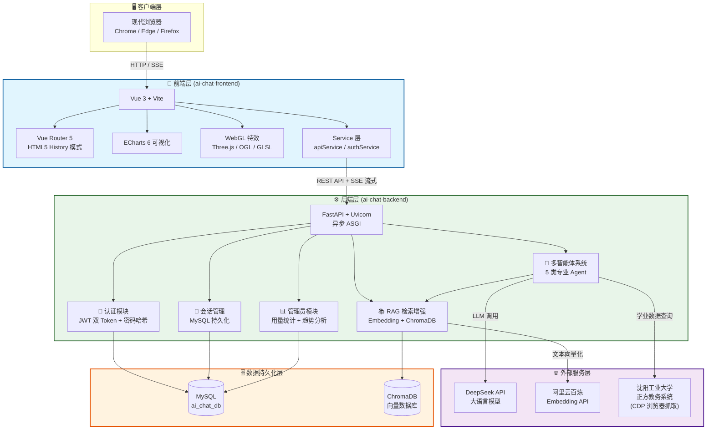
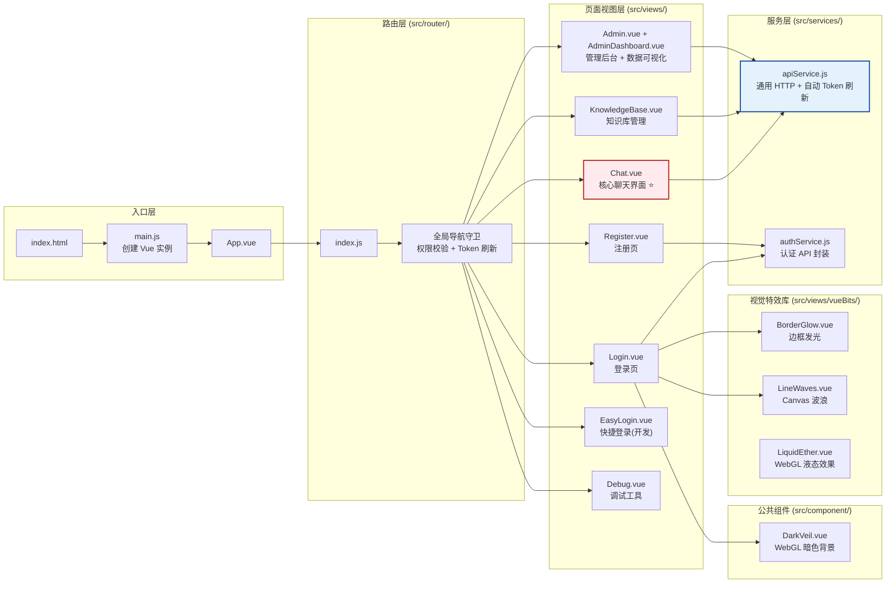
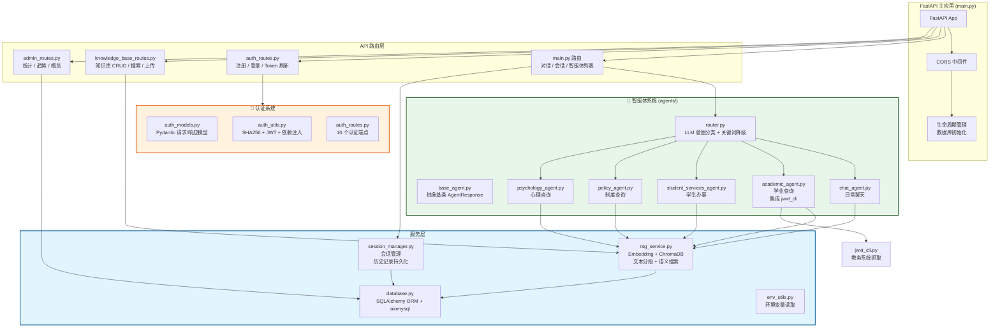
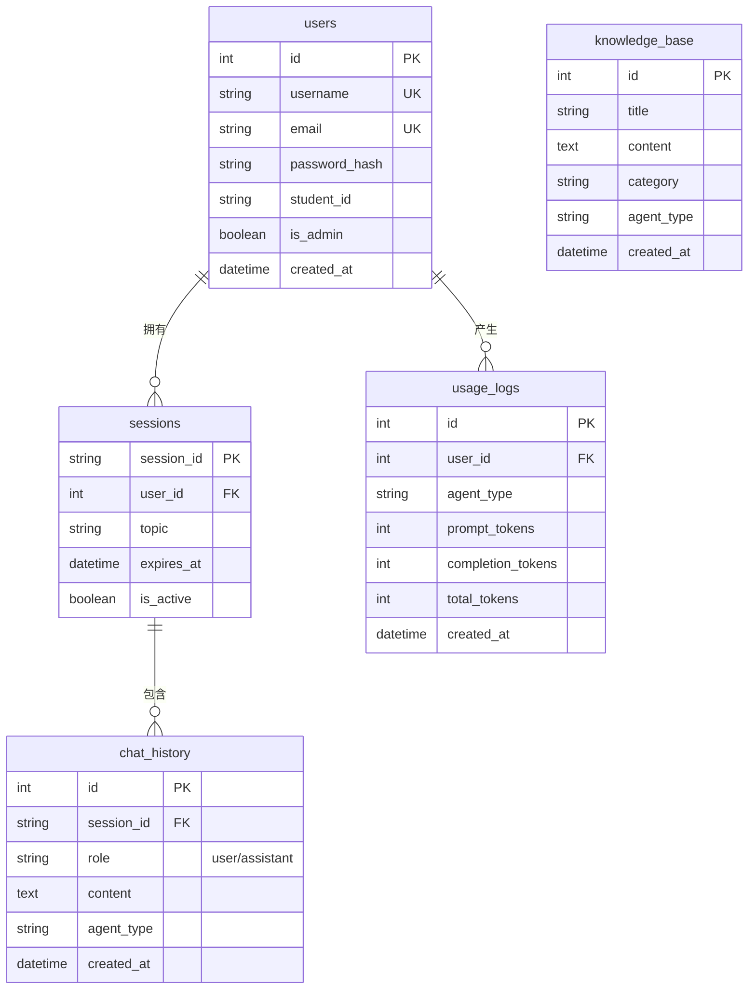
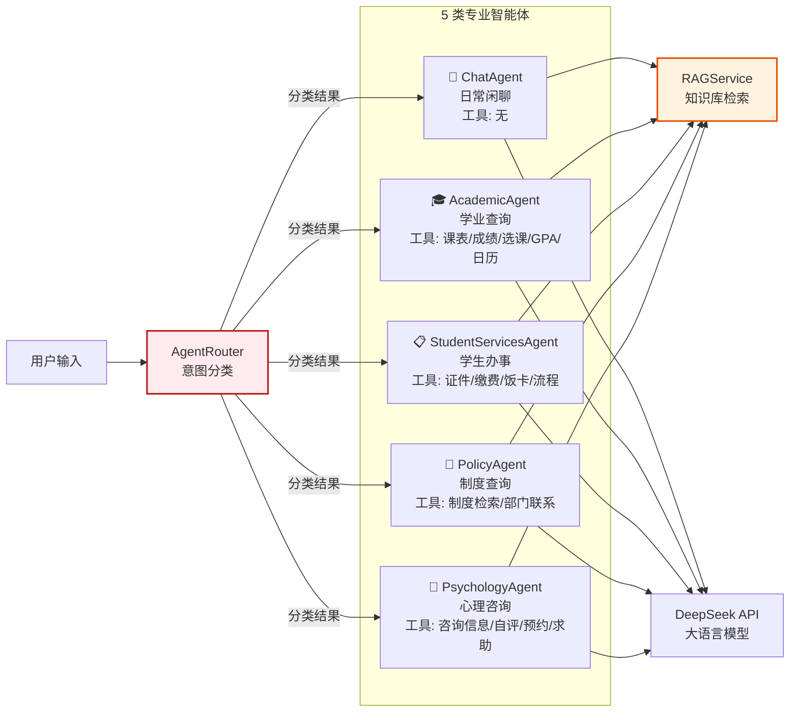
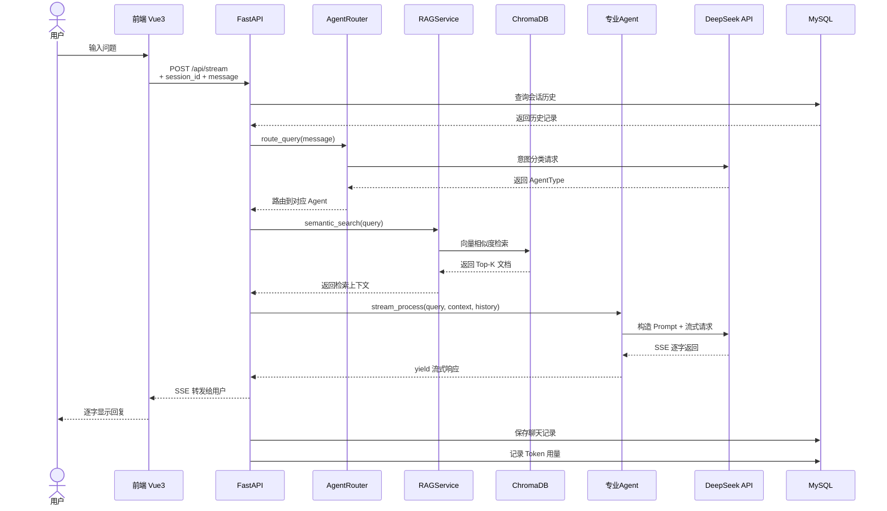

# 项目架构图

> 本项目是一个基于 **Vue 3 + FastAPI** 的 AI 智能问答系统，面向高校学生服务场景（沈阳工业大学）。

---

## 一、整体系统架构



---

## 二、前端详细架构



### 前端路由映射表

| 路由路径 | 对应组件 | 访问权限 |
|---------|---------|---------|
| `/` | → 重定向到 `/debug` | 公开 |
| `/debug` | Debug.vue | 公开 |
| `/login` | Login.vue | 未登录用户（`requiresGuest`） |
| `/register` | Register.vue | 未登录用户（`requiresGuest`） |
| `/easylogin` | EasyLogin.vue | 未登录用户（`requiresGuest`） |
| `/chat` | Chat.vue | 已登录用户（`requiresAuth`） |
| `/knowledge-base` | KnowledgeBase.vue | 已登录用户（`requiresAuth`） |
| `/admin` | Admin.vue + AdminDashboard.vue | 管理员（`requiresAuth + requiresAdmin`） |
| `/*` | → 重定向到 `/debug` | 公开 |

---

## 三、后端详细架构



### 后端 API 端点汇总

| 模块 | 路由前缀 | 核心端点 | 说明 |
|-----|---------|---------|-----|
| **核心对话** | `/api/` | `POST /chat` / `POST /stream` / `POST /direct` | 多轮对话 + SSE 流式 + 直连智能体 |
| **会话管理** | `/api/` | `GET/POST/DELETE /sessions/*` | 会话 CRUD + 历史记录 |
| **认证** | `/api/auth/` | `POST /register` / `POST /login` / `POST /refresh` 等 | JWT 双 Token 认证体系 |
| **知识库** | `/api/knowledge-base/` | `GET/POST/PUT/DELETE /entries` / `POST /search` / `POST /upload` | 知识库管理 + 语义搜索 + 文件上传 |
| **管理后台** | `/api/admin/` | `GET /overview` / `GET /stats/users` / `GET /stats/agents` / `GET /trends` | 用量统计与趋势分析 |

---

## 四、数据库 E-R 架构



---

## 五、智能体路由与工具链



---

## 六、数据流向图（一次完整对话）



---

## 七、技术栈总览

### 前端
| 类别 | 技术 |
|-----|------|
| 框架 | Vue 3.5 + Vite 7 |
| 路由 | Vue Router 5 (HTML5 History) |
| 状态管理 | 无集中式 (localStorage + 组件内部状态) |
| HTTP 请求 | 原生 fetch + 自定义封装 |
| 图表可视化 | ECharts 6 + vue-echarts |
| Markdown 渲染 | marked 18 |
| 3D/特效 | Three.js + OGL + 自定义 GLSL Shader |

### 后端
| 类别 | 技术 |
|-----|------|
| Web 框架 | FastAPI + Uvicorn (ASGI) |
| ORM | SQLAlchemy 2.0 + aiomysql (异步) |
| LLM 框架 | LangChain + langchain-deepseek |
| 向量数据库 | ChromaDB 0.5+ |
| Embedding | 阿里云百炼 API / Sentence-Transformer 本地回退 |
| 认证 | python-jose (JWT) + passlib (bcrypt) |
| Token 计数 | tiktoken |
| 文件解析 | PyPDF2 + python-docx |

### 基础设施
| 类别 | 技术 |
|-----|------|
| 数据库 | MySQL (ai_chat_db) |
| 向量库 | ChromaDB (本地持久化) |
| LLM 服务 | DeepSeek API |
| 外部数据 | 正方教务系统 (CDP 浏览器协议) |

---

## 八、项目目录总览

```
xiangyuan4/                              # 项目根目录
├── ai-chat-frontend/                    # 🎨 前端项目
│   ├── src/
│   │   ├── main.js                      # 应用入口
│   │   ├── App.vue                      # 根组件
│   │   ├── router/index.js              # 路由配置 + 导航守卫
│   │   ├── services/
│   │   │   ├── apiService.js            # HTTP 请求封装
│   │   │   └── authService.js           # 认证 API
│   │   ├── views/
│   │   │   ├── Chat.vue                 # ⭐ 核心聊天界面
│   │   │   ├── KnowledgeBase.vue        # 知识库管理
│   │   │   ├── Admin.vue                # 管理后台布局
│   │   │   ├── AdminDashboard.vue       # 数据可视化仪表盘
│   │   │   ├── Login.vue                # 登录页
│   │   │   ├── Register.vue             # 注册页
│   │   │   ├── EasyLogin.vue            # 快捷登录
│   │   │   ├── Debug.vue                # 调试页
│   │   │   └── vueBits/                 # 视觉特效组件
│   │   │       ├── BorderGlow.vue
│   │   │       ├── LineWaves.vue
│   │   │       └── LiquidEther.vue
│   │   └── component/DarkVeil/          # 公共 WebGL 背景
│   ├── package.json
│   └── vite.config.js
│
└── ai-chat-backend/                     # ⚙️ 后端项目
    ├── main.py                          # FastAPI 主入口
    ├── database.py                      # SQLAlchemy ORM + 5 张表
    ├── rag_service.py                   # RAG 核心服务
    ├── session_manager.py               # 会话管理
    ├── auth_routes.py                   # 认证路由 (10 端点)
    ├── auth_models.py                   # Pydantic 认证模型
    ├── auth_utils.py                    # JWT + 密码哈希工具
    ├── knowledge_base_routes.py         # 知识库路由 (8 端点)
    ├── admin_routes.py                  # 管理后台路由 (5 端点)
    ├── env_utils.py                     # 环境变量读取
    ├── jwxt_cli.py                      # 教务系统 CLI 工具
    ├── init_db.py                       # 数据库初始化
    ├── fix_db.py                        # 数据库修复脚本
    ├── .env                             # 环境变量配置
    ├── requirements.txt
    └── agents/                          # 🤖 智能体模块
        ├── __init__.py
        ├── base_agent.py                # 抽象基类
        ├── router.py                    # 智能体路由
        ├── chat_agent.py                # 日常聊天
        ├── academic_agent.py            # 学业查询
        ├── student_services_agent.py    # 学生办事
        ├── policy_agent.py              # 制度查询
        └── psychology_agent.py          # 心理咨询
```

---

*架构文档生成时间: 2026-04-25*
